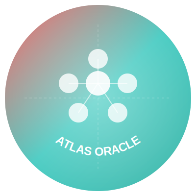
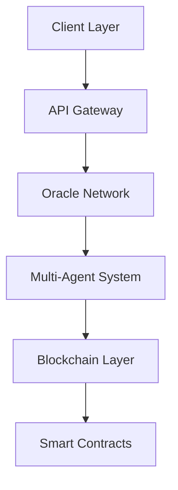

# AtlasOracle

<div align="center">



[](https://opensource.org/licenses/MIT)
[](https://twitter.com/AtlasOracle)
[](https://discord.gg/atlasoracle)

> Collective Intelligence Unleashed: Where Ancient Wisdom Meets Neural Networks

[Demo](https://demo.atlasoracle.com) • [Documentation](https://docs.atlasoracle.com) • [Community](https://discord.gg/atlasoracle)

</div>

---

AtlasOracle is a groundbreaking multi-mind AI oracle platform that channels collective intelligence by bridging timeless wisdom with bleeding-edge technology. Our system synthesizes insights across domains by simulating interactions between history's greatest minds.

## 📋 Table of Contents

- [AtlasOracle](#atlasoracle)
  - [📋 Table of Contents](#-table-of-contents)
  - [🌟 Features](#-features)
  - [🚀 Quick Start](#-quick-start)
  - [🏗 Architecture](#-architecture)
  - [💎 Tokenomics](#-tokenomics)
  - [🛠 Technical Stack](#-technical-stack)
  - [🎨 Design System](#-design-system)
    - [Colors](#colors)
  - [🔒 Security](#-security)
  - [📚 Documentation](#-documentation)
  - [🚀 Deployment](#-deployment)
  - [👥 Community \& Governance](#-community--governance)
    - [Governance Process](#governance-process)
  - [🤝 Contributing](#-contributing)
    - [Development Process](#development-process)
  - [📄 License](#-license)

## 🌟 Features

- **Multi-Agent Architecture**: Experience multi-mind intelligence through our advanced neural network system
- **Collective Intelligence Network**: Leverage insights from simulated interactions between historical genius minds
- **Real-time Wisdom Synthesis**: Get quantum-enriched insights across multiple domains
- **Cross-Domain Analysis**: From tech forecasting to market insights, powered by multiple expert perspectives
- **Decentralized Oracle Network**: Trustless, transparent, and verifiable AI predictions
- **Smart Contract Integration**: Seamless integration with major blockchain networks
- **Zero-Knowledge Proofs**: Privacy-preserving intelligence gathering
- **Cross-Chain Compatibility**: Support for Ethereum, Solana, Polkadot, and more

## 🚀 Quick Start

1. **Install Dependencies**

```bash
npm install
# or
yarn install
# or
pnpm install
```

2. **Configure Environment**

```bash
cp .env.example .env
# Edit .env with your configuration
```

3. **Run Development Server**

```bash
npm run dev
# or
yarn dev
# or
pnpm dev
```

Open [http://localhost:3000](http://localhost:3000) to view the application.

## 🏗 Architecture



## 💎 Tokenomics

- **Token Name**: AORA
- **Total Supply**: 1,000,000,000 AORA
- **Distribution**: all fair launch via Pump.fun https://pump.fun/coin/DYDxokXaoEFakMWjAYXdAJNKHqKC6W73fZWdcfg5pump

## 🛠 Technical Stack

- **Framework**: [Next.js](https://nextjs.org)
- **Blockchain**: Solana
- **Smart Contracts**: Rust
- **Oracle Network**: Custom implementation
- **Styling**: Modern UI with cyber-pastel gradients and neo-brutalist elements
- **Typography**: 
  - Headlines: Cabinet Grotesk
  - Body: Instrument Sans
  - Code: JetBrains Mono

## 🎨 Design System

### Colors
- Primary: `#4ECDC4` (Cyber Teal)
- Secondary: `#FF6B6B` (Neo Coral)
- Deep Space: `#1A1A2E`
- Chrome White: `#FFFFFF`
- Quantum Gray: `#8892B0`

## 🔒 Security

- **Audits**: [CertiK](https://certik.com) - In Progress
- **Bug Bounty**: Up to 100,000 USDC for critical vulnerabilities
- **Security Features**:
  - Multi-signature wallets
  - Time-locked contracts
  - Formal verification
  - Regular security assessments

## 📚 Documentation

For detailed documentation and guides, visit our documentation site:

- [Getting Started Guide](docs/guide/getting-started.md)
- [Technical Architecture](docs/guide/technical-architecture.md)
- [Theoretical Foundations](docs/guide/theoretical-foundations.md)
- [Smart Contract Documentation](docs/guide/smart-contracts.md)
- [API Reference](docs/guide/api-reference.md)
- [Security Model](docs/guide/security.md)

## 🚀 Deployment

Deploy on [Vercel](https://vercel.com/new?utm_medium=default-template&filter=next.js&utm_source=create-next-app&utm_campaign=create-next-app-readme), the platform from the creators of Next.js:

1. Push your code to GitHub
2. Import your repository to Vercel
3. Deploy with a single click

For smart contract deployment:
```bash
npx hardhat deploy --network mainnet
```

## 👥 Community & Governance

- [Telegram Community](https://t.me/atlasoracle)
- [Twitter](https://x.com/Atlas_Oracle)
- [Blog](https://blog.atlasoracle.com)

### Governance Process
1. Proposal submission
2. Community discussion (3 days)
3. Voting period (5 days)
4. Implementation (if approved)

## 🤝 Contributing

We welcome contributions! Please see our [Contributing Guide](docs/community/index.md) for details.

### Development Process
1. Fork the repository
2. Create your feature branch
3. Commit your changes
4. Push to the branch
5. Create a Pull Request

## 📄 License

This project is licensed under the MIT License - see the [LICENSE](LICENSE) file for details.

---

<div align="center">

Built with ❤️ by the AtlasOracle Team

[Website](https://atlasoracle.com) • [Documentation](https://docs.atlasoracle.com) • [Twitter](https://twitter.com/AtlasOracle)

</div>
