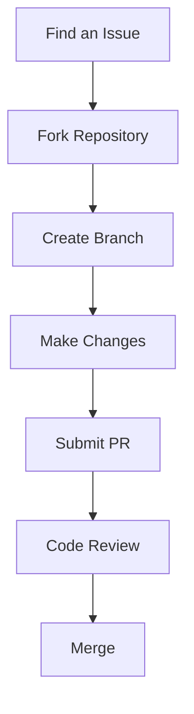
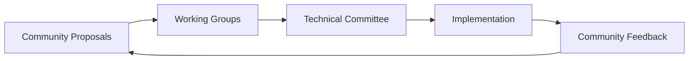

# Atlas Oracle Community

## Join the Revolution 🧠 ⌛

Welcome to the Atlas Oracle community! We're building the future of collective intelligence together. Our community brings together researchers, developers, and innovators from quantum computing, AI, and various scientific domains.

## Ways to Contribute

### Code Contributions

1. Fork the repository
2. Create a feature branch
3. Make your changes
4. Submit a pull request
5. Participate in code review

### Research Contributions
- Submit research papers
- Share experimental results
- Propose new algorithms
- Validate theoretical models

### Documentation
- Improve technical docs
- Write tutorials
- Create examples
- Translate content

## Community Channels

### Real-time Communication
- [Discord Server](https://discord.gg/atlas-oracle)
- [Telegram Group](https://t.me/atlas-oracle)
- [Matrix Channel](https://matrix.to/#/#atlas-oracle:matrix.org)

### Asynchronous Discussion
- [GitHub Discussions](https://github.com/atlas-oracle/discussions)
- [Forum](https://forum.atlas-oracle.com)
- [Reddit](https://reddit.com/r/AtlasOracle)

## Working Groups

### Research Groups
- Quantum Computing
- Multi-Agent Systems
- Temporal Intelligence
- Ethical AI

### Development Teams
- Core Protocol
- Client Libraries
- Tools & Infrastructure
- Documentation

### Special Interest Groups
- Climate Solutions
- Healthcare Innovation
- Education Transformation
- Economic Systems

## Events

### Regular Events
- Monthly Community Calls
- Research Presentations
- Hackathons
- Training Workshops

### Annual Events
- Atlas Oracle Conference
- Research Symposium
- Developer Summit
- Community Meetups

## Governance

### Decision Making

### Roles & Responsibilities
- Core Contributors
- Working Group Leads
- Community Moderators
- Documentation Maintainers

## Resources

### Development
- [GitHub Repository](https://github.com/atlas-oracle)
- [Development Guide](/guide/development)
- [API Documentation](/api)
- [Example Projects](/examples)

### Research
- [Research Papers](/research/papers)
- [Technical Specs](/guide/technical-architecture)
- [Theoretical Foundations](/guide/theoretical-foundations)
- [Experiment Results](/research/experiments)

## Recognition Program

### Contributor Levels
- Quantum Pioneer
- Agent Architect
- Temporal Guardian
- Ethics Champion

### Rewards
- Community recognition
- Conference invitations
- Research grants
- Development funds

## Code of Conduct

### Core Values
- Respect & Inclusion
- Scientific Integrity
- Ethical Innovation
- Open Collaboration

### Guidelines
- Be respectful and inclusive
- Focus on constructive feedback
- Maintain scientific rigor
- Support new members

## Support

### Getting Help
- [Documentation](/docs)
- [FAQ](/faq)
- [Technical Support](/support)
- Community channels

### Reporting Issues
- Security vulnerabilities
- Code of conduct violations
- Technical issues
- Documentation problems

## Future Vision

### Community Goals
- Global research network
- Open innovation ecosystem
- Ethical AI development
- Societal impact

### Roadmap Input
- Feature proposals
- Research directions
- Use case development
- Implementation feedback

Join us in building the future of collective intelligence. Together, we can solve humanity's greatest challenges through quantum-enhanced multi-agent systems and ethical AI development. 