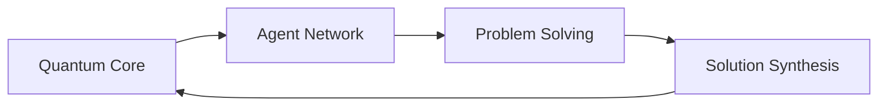

# Getting Started with Atlas Oracle

## Quick Start

### Installation
```bash
# Install Atlas Oracle SDK
npm install @atlas-oracle/sdk

# Install required dependencies
npm install @atlas-oracle/quantum @atlas-oracle/agents @atlas-oracle/temporal
```

### Basic Usage
```typescript
import { AtlasOracle, QuantumNetwork, AgentSystem } from '@atlas-oracle/sdk';

// Initialize Atlas Oracle
const atlas = new AtlasOracle({
  quantum: {
    processors: 2,
    qubits: 100
  },
  agents: {
    count: 5,
    specializations: ['research', 'analysis', 'synthesis']
  }
});

// Start the agent network
await atlas.start();

// Submit a problem
const result = await atlas.solve({
  domain: 'scientific-research',
  question: 'Optimize quantum error correction in multi-agent systems',
  constraints: {
    timeframe: '2024-2030',
    ethical: true
  }
});
```

## System Requirements

### Hardware Requirements
- Quantum processing unit (recommended)
- 16GB RAM minimum
- Multi-core processor
- High-speed internet connection

### Software Requirements
- Node.js 18+
- Python 3.9+
- Quantum development kit
- Docker (optional)

## Core Components

### Quantum Network


### Agent System
- Specialist agents
- General-purpose agents
- Learning modules
- Evolution mechanisms

### Temporal Framework
- Historical analysis
- Present context
- Future modeling
- Time-aware decision making

## Development Setup

### Environment Configuration
```yaml
# config.yaml
quantum:
  processors: 2
  qubits: 100
  error_correction: true

agents:
  count: 5
  specializations:
    - research
    - analysis
    - synthesis

temporal:
  historical_depth: 1000
  future_horizon: 100
```

### API Keys
```typescript
// Set up API keys
atlas.configure({
  apiKey: 'your-api-key',
  quantum: {
    provider: 'quantum-service',
    apiKey: 'quantum-api-key'
  }
});
```

## Basic Tutorials

### 1. Creating an Agent Network
```typescript
// Initialize specialized agents
const network = new AgentNetwork({
  specialists: [
    { type: 'researcher', focus: 'quantum-computing' },
    { type: 'analyst', focus: 'data-processing' },
    { type: 'synthesizer', focus: 'knowledge-integration' }
  ]
});

// Start the network
await network.initialize();
```

### 2. Problem Solving
```typescript
// Define a problem
const problem = {
  domain: 'scientific-research',
  question: 'Optimize quantum circuits',
  constraints: {
    time: '48h',
    resources: 'quantum-preferred'
  }
};

// Solve the problem
const solution = await atlas.solve(problem);
```

### 3. Temporal Analysis
```typescript
// Perform temporal analysis
const analysis = await atlas.temporal.analyze({
  historical: { startYear: 1900, endYear: 2024 },
  future: { horizon: 2030 },
  topic: 'quantum-computing-evolution'
});
```

## Advanced Features

### Quantum Enhancement
- Circuit optimization
- Error correction
- State preparation
- Measurement protocols

### Agent Evolution
- Learning mechanisms
- Specialization development
- Performance optimization
- Collective improvement

### Security Integration
- Post-quantum cryptography
- Access control
- Privacy preservation
- Audit trails

## Best Practices

### Code Organization
```
atlas-project/
├── config/
│   ├── quantum.yaml
│   ├── agents.yaml
│   └── temporal.yaml
├── src/
│   ├── agents/
│   ├── quantum/
│   └── temporal/
└── tests/
```

### Performance Optimization
- Quantum resource management
- Agent load balancing
- Memory optimization
- Network efficiency

### Security Guidelines
- API key management
- Access control
- Data encryption
- Audit logging

## Troubleshooting

### Common Issues
1. Quantum connection errors
2. Agent initialization failures
3. Temporal analysis timeouts
4. Resource constraints

### Debug Tools
```typescript
// Enable debug mode
atlas.debug.enable({
  level: 'verbose',
  components: ['quantum', 'agents', 'temporal']
});

// Monitor performance
atlas.monitor.start();
```

## Next Steps

### Advanced Topics
1. [Custom Agent Development](/guide/custom-agents)
2. [Quantum Circuit Design](/guide/quantum-circuits)
3. [Temporal Framework Integration](/guide/temporal-framework)

### Community Resources
- [Discord Community](https://discord.gg/atlas-oracle)
- [GitHub Repository](https://github.com/atlas-oracle)
- [Documentation](/docs)
- [API Reference](/api) 