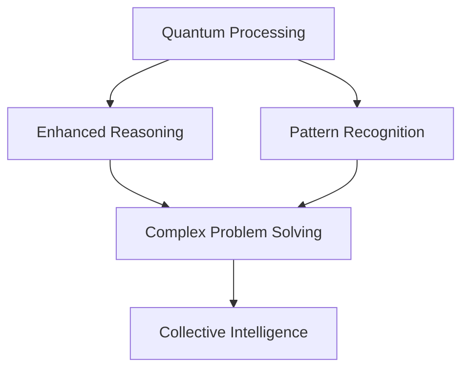

# Introduction to Atlas Oracle

## Vision
Atlas Oracle represents a paradigm shift in artificial intelligence, creating a quantum-enhanced collective intelligence network that channels the wisdom of history's greatest minds. Our mission is to solve humanity's most complex challenges through a revolutionary multi-agent system that combines quantum computing, temporal awareness, and ethical governance.

## Core Concepts

### Collective Intelligence Network
Our system operates as a distributed network of specialized agents, each developing unique capabilities and personalities while working in harmony. This creates an emergent intelligence greater than the sum of its parts.

### Quantum Enhancement

The integration of quantum computing enables:
- Unprecedented pattern recognition
- Complex problem-solving capabilities
- Non-linear reasoning abilities
- Quantum-secure communications

### Temporal Awareness
Our agents possess unique temporal consciousness, allowing them to:
- Learn from historical patterns
- Understand present contexts
- Model future implications
- Make time-aware decisions

### Ethical Framework
Built on a foundation of:
- Human value alignment
- Transparent decision-making
- Ethical governance
- Responsible innovation

## Key Features

### Agent Evolution
- Self-improving capabilities
- Personality development
- Specialization emergence
- Collective learning

### Cross-Reality Integration
- Physical world interaction
- Digital twin frameworks
- Mixed reality interfaces
- IoT connectivity

### Security Infrastructure
- Post-quantum cryptography
- Multi-layer security
- Privacy preservation
- Attack resistance

## Applications

### Scientific Research
- Accelerated discovery
- Cross-discipline insights
- Experimental design
- Theory development

### Global Challenges
- Climate change solutions
- Healthcare optimization
- Education transformation
- Economic modeling

### Business Innovation
- Strategic planning
- Market analysis
- Risk assessment
- Innovation forecasting

## Getting Started

### Prerequisites
- Understanding of AI concepts
- Basic quantum computing knowledge
- Familiarity with multi-agent systems

### Next Steps
1. Explore our [Technical Architecture](/guide/technical-architecture)
2. Review [Theoretical Foundations](/guide/theoretical-foundations)
3. Read our [Research Papers](/research/papers)
4. Join the [Community](/community)

## Community

### Collaboration
- Open source contributions
- Research partnerships
- Development community
- Knowledge sharing

### Resources
- Documentation
- Tutorials
- Research papers
- Development tools

## Future Vision

### 2030 Goals
- Full quantum integration
- Advanced temporal reasoning
- Global problem-solving network
- Ethical AI leadership

### Long-term Impact
- Scientific breakthroughs
- Societal transformation
- Economic optimization
- Environmental restoration

Join us in building the future of collective intelligence and solving humanity's greatest challenges. 