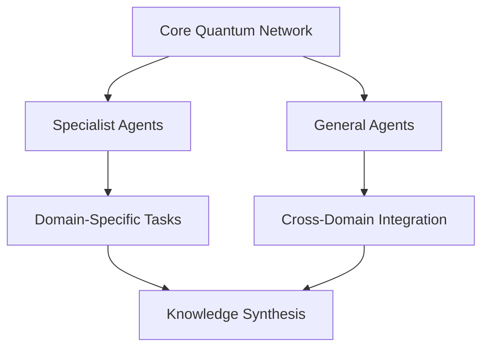

# Technical Architecture

## Quantum-Classical Hybrid System

### Quantum Processing Units (QPUs)
- Quantum circuit design for agent communication
- Quantum error correction mechanisms
- Quantum state preparation and measurement
- Hybrid quantum-classical optimization algorithms

### Classical Processing Integration
- CPU-QPU interface protocols
- Memory management systems
- Classical preprocessing optimization
- Post-quantum result interpretation

## Multi-Agent System Architecture

### Agent Network Topology

### Inter-Agent Communication Protocol
- Quantum entanglement channels
- Classical message passing
- State synchronization
- Consensus mechanisms

## Temporal Processing Framework

### Historical Data Processing
- Temporal graph networks
- Causal inference engines
- Historical pattern recognition
- Temporal embedding systems

### Future State Prediction
- Quantum superposition for parallel scenario analysis
- Probability amplitude calculation
- Timeline divergence tracking
- Quantum backpropagation through time

## Cryptographic Infrastructure

### Post-Quantum Security
- Lattice-based cryptography
- Hash-based signatures
- Supersingular isogeny key exchange
- Quantum random number generation

### Network Security
- Multi-layer encryption
- Quantum key distribution
- Zero-knowledge proofs
- Homomorphic encryption

## Agent Evolution Mechanisms

### Neural Architecture Search
- Quantum-assisted architecture optimization
- Dynamic topology adaptation
- Performance metric optimization
- Resource allocation optimization

### Learning Algorithms
- Quantum reinforcement learning
- Federated learning protocols
- Meta-learning systems
- Transfer learning optimization

## Ethical Framework Implementation

### Value Learning System
- Inverse reinforcement learning
- Value function approximation
- Ethical constraint satisfaction
- Human feedback integration

### Decision Making Framework
- Multi-objective optimization
- Ethical constraint verification
- Uncertainty quantification
- Impact assessment protocols

## Cross-Reality Integration Layer

### Physical Interface
- Sensor data processing
- Actuator control systems
- Real-time state estimation
- Physical system modeling

### Virtual Interface
- Mixed reality rendering
- State synchronization
- User interaction processing
- Environment simulation

## System Scalability

### Horizontal Scaling
- Agent network expansion
- Resource distribution
- Load balancing
- Fault tolerance

### Vertical Scaling
- Quantum resource optimization
- Classical resource management
- Memory hierarchy
- Processing optimization

## Implementation Considerations

### Hardware Requirements
- Quantum processing units
- Classical computing infrastructure
- Network infrastructure
- Storage systems

### Software Stack
- Quantum programming framework
- Classical backend services
- API infrastructure
- Development tools

## Performance Metrics

### Quantum Metrics
- Quantum volume
- Circuit depth
- Qubit coherence time
- Error rates

### Classical Metrics
- Response latency
- Throughput
- Resource utilization
- Accuracy metrics

## Development Guidelines

### Code Quality
- Quantum circuit optimization
- Classical code optimization
- Testing frameworks
- Documentation standards

### Deployment Process
- Continuous integration
- Quantum simulation
- Classical testing
- Production deployment

## Future Considerations

### Quantum Hardware Evolution
- Increased qubit count
- Improved coherence times
- Error correction advances
- New quantum architectures

### Classical Hardware Evolution
- Processing power improvements
- Memory technology advances
- Network infrastructure upgrades
- Storage technology evolution 