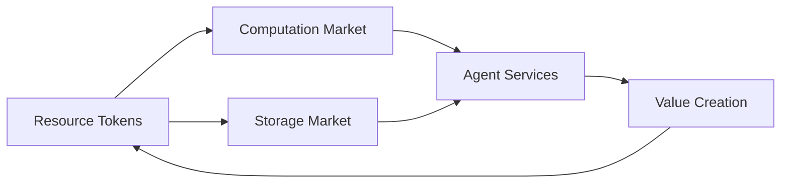

# Theoretical Foundations

## Mechanism Design

### Incentive Alignment
- Agent utility functions
- Nash equilibrium in multi-agent systems
- Pareto efficiency optimization
- Mechanism truthfulness guarantees

### Resource Allocation
- Quantum resource markets
- Computational resource pricing
- Storage allocation mechanisms
- Network bandwidth distribution

### Token Economics

## Game Theory

### Multi-Agent Games
- Non-cooperative game equilibria
- Cooperative game solutions
- Repeated game dynamics
- Evolutionary stable strategies

### Strategic Interaction
- Information sharing protocols
- Resource competition models
- Collaboration mechanisms
- Conflict resolution strategies

## Cryptoeconomic Principles

### Token Mechanism Design
- Utility token models
- Governance token systems
- Staking mechanisms
- Reward distribution

### Economic Security
- Attack cost analysis
- Security deposit systems
- Slashing conditions
- Economic incentive alignment

## Quantum Game Theory

### Quantum Strategies
- Quantum superposition in decision making
- Entanglement-based coordination
- Quantum Nash equilibria
- Quantum mechanism design

### Quantum Information Economics
- Quantum information valuation
- Quantum state markets
- Entanglement resource pricing
- Quantum communication economics

## Temporal Mechanism Design

### Time-Aware Incentives
- Intertemporal choice models
- Future value discounting
- Temporal consistency enforcement
- Long-term alignment mechanisms

### Dynamic Mechanism Design
- State-dependent mechanisms
- Adaptive incentive structures
- Learning mechanism design
- Evolution of mechanism parameters

## Value Alignment Theory

### Ethical Framework Design
- Value learning mechanisms
- Preference aggregation
- Moral uncertainty handling
- Value function evolution

### Alignment Mechanisms
- Principal-agent alignment
- Multi-stakeholder coordination
- Value drift prevention
- Ethical constraint markets

## Economic Models

### Agent Economy
- Service pricing models
- Resource exchange mechanisms
- Value creation tracking
- Economic efficiency metrics

### Market Design
- Double auction mechanisms
- Matching markets
- Prediction markets
- Information markets

## Governance Systems

### Decentralized Governance
- Voting mechanisms
- Proposal systems
- Decision aggregation
- Stake-weighted governance

### Upgrade Mechanisms
- Protocol evolution
- Parameter adjustment
- Feature addition process
- Backward compatibility

## Risk Management

### Systemic Risk
- Cascade failure prevention
- System stability analysis
- Risk quantification
- Insurance mechanisms

### Security Economics
- Attack surface economics
- Defense mechanism design
- Security investment models
- Risk-reward optimization

## Scalability Theory

### Economic Scaling
- Layer 2 economics
- Sharding mechanisms
- State channel design
- Rollup economics

### Network Effects
- Network growth models
- Value scaling laws
- Adoption dynamics
- Network stability

## Future Research Directions

### Advanced Mechanism Design
- Quantum mechanism design
- Dynamic mechanism adaptation
- Cross-reality mechanisms
- Temporal mechanism evolution

### Economic Model Evolution
- Quantum economic models
- Hybrid classical-quantum markets
- Advanced pricing mechanisms
- Novel incentive structures 